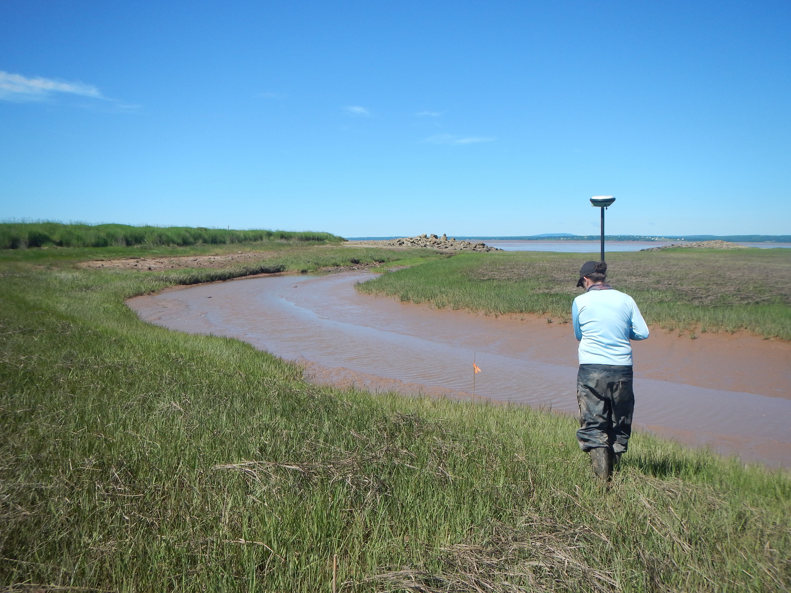
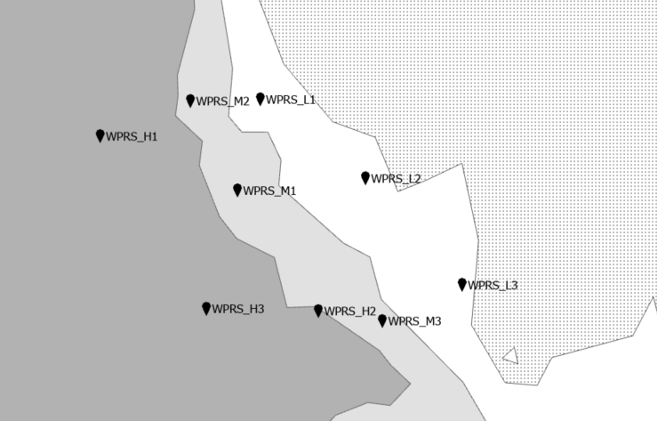
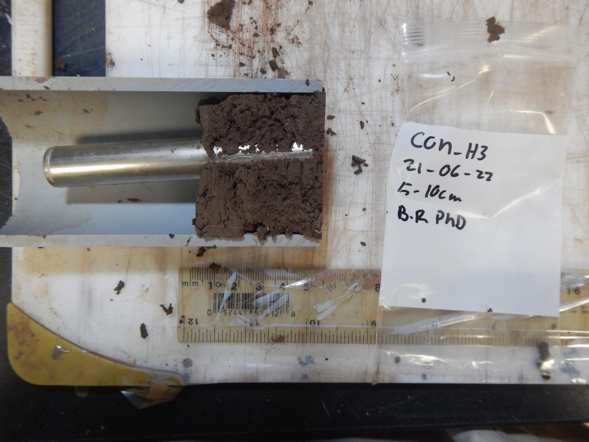
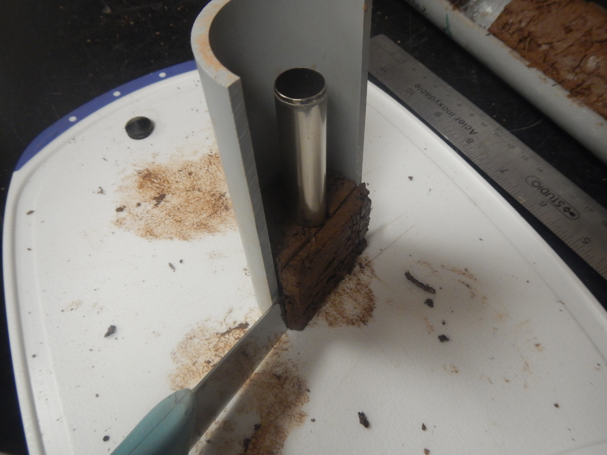

<!-- ### Case Study 1: Organic carbon stocks of restored salt marshes along the upper Bay of Fundy -->

#### Step 1:  Choosing representative sites and study areas

Four study sites in the Upper Bay of Fundy along the Cumberland Basin were chosen to represent salt marshes at different stages of restoration:  Converse - newly restored, Aulac - restored over 10 years ago, John Lusby - passively restored over 50 years ago, and Wood Point Rest Stop - natural reference site. Sites were chosen to be close to one another (<10 km apart) so environmental conditions like tides and weather were similar between sites. 



The Wood Point Rest Stop (WPRS) will be used as an example in this case study. Each site was divided into three elevation zones that are flooded by tides differently throughout the year: the low zone is flooded by 75% of high tides in a year, the mid zone flooded by 50% of high tides, and the high zone is flooded by 25% of high tides. These zones are based on flooding frequency because decomposition of organic matter by microbes is slowed down in flooded, low-oxygen conditions. 



#### Step 2:  Collection of sediment cores

<!-- 
 
 
{width="50%"}

{width="40%"}

 
{width="40%"} 

 -->

Three random points within each zone were chosen for core extraction using Geographic Information System (GIS) software (ArcGIS Pro) and the location of each point was surveyed using a high-accuracy GPS system. In total, nine cores were collected from each study site. The photo below (left) shows someone surveying core locations at the Aulac site. The maps below show the location of nine cores in the Wood Point Rest Stop study site within the three elevation zones. 


    
    
    


Cores were collected using a gouge auger (images below), one of the many types of ‘corers’ available to use by soil carbon scientists. Other coring types include the ‘Russian peat corer’ (extracts half a core) and manual extraction (hammering a sharpened tube into the ground). Each of these methods will create different levels of core ‘compaction’, which can affect the overall length of the core and influence the estimate of how much soil organic carbon is contained within each core. Depending on the length of the core, the process of pushing the coring device into the ground and extracting a core can be physically demanding and often requires teamwork.


    
    


Transport and handling of cores after they are taken out of the ground is another important consideration for field work. Sometimes cores are cut apart and sub-sampled in the field, and other times cores are packed in rigid plastic shells, wrapped in plastic-wrap, and refrigerated or frozen before being processed back in the lab. In salt marshes, researchers often have to walk far into study sites across uneven terrain with heavy equipment (like the corer and a cooler) to retrieve cores and bring them back. 


    
    


#### Step 3:  Processing of cores in the lab

Once back in the lab, processing the core starts. The cores are photographed and different features like soil colour and texture are described and recorded. Then cores are divided into different increments depending on the goals of the study. For this study, 5 cm increments were chosen for a total of 10 per 50 cm core, which means that 360 individual samples were processed! When dividing cores, a compression factor should be used to adjust the increment length based on the compaction measured in the field. Compaction is often assumed equal across the entirety of the core, unless compaction is measured periodically throughout the core extraction process in the field.


    
    


To calculate how much organic carbon is in a core, two measurements are needed - ‘bulk density’ and ‘organic carbon content’ or ‘% organic carbon’. Core increments are usually sampled for bulk density first, which is a measure of the dry weight of soil within a known volume of the core. In the photo below, a metal cylinder was inserted into the centre of each 5 cm increment. The soil sample was extracted using a syringe plunger and then dried in an oven (see Step 4). Often the same soil sample is also used to determine the organic carbon content of the increment, but others can be cut from the core and stored until they are processed.


    
    


<!--  
 
 
  -->

Once processing is done, any remaining core segments are often archived and frozen for future analyses. Freezer and refrigerator space is a very important factor to consider when taking soil cores and designing the field study, as cores should be kept cold (< 4℃) to prevent decomposition of organic matter by microbes. 


    


#### Step 4:  Lab analyses for bulk density and loss-on-ignition (LOI)

The soil samples of known volume taken from the core are first dried to determine the bulk density. Wet samples are placed in individually labeled tins, weighed, and then dried at 60 ℃ in a drying oven for 24-72 hours (or until a consistent dried weight is reached). After they are completely dry, they are re-weighed to determine dry weight of the soil sample. The photos below show the dried soil cylinders in a dessicator after the oven, which ensures the samples are fully dried before being re-weighed. Bulk density is written as the dry weight of soil divided by the known volume of the sample (grams per cm3). Low bulk density means there is not a lot of soil within the volume of core sampled, which means the soil is less densely packed and there are more air pockets. Soils with low bulk density often have high organic matter content and water-holding capacity (like a sponge!). 


    
    


After the soil samples are dried and bulk density is determined, the soil samples are often processed for loss-on-ignition (LOI), which is an estimate of how much ‘organic matter’ is a soil sample. Before the samples are put into the furnace, the soil sample needs to be crushed into a homogenous sample, often using a mortar and pestle. Depending on how much organic matter is in the sample, this can be time consuming.


    
    


LOI involves combusting the soil sample at a high temperature (550 ℃) in a muffle furnace for 4 hours. Before the soil samples are put into the furnace, they are placed in a ceramic crucible and weighed to a consistent starting weight. After the samples are combusted, they are re-weighed to determine how much mass was lost, which corresponds to how much organic matter was burnt off from the sample and is represented by ‘% organic matter’ of the sample. Sometimes accidents happen but often duplicate or triplicate samples are done for LOI, so it can take a significant amount of time to get through that many samples. Soil carbon scientists often use different methods for LOI, which may affect the comparison of results between datasets. As there is no standard method, it is recommended to report and be consistent in three parameters: ignition temperature, exposure time, and starting weight.


    
    
    


#### Step 5:  Data processing and interpretation

Once bulk density and % organic matter are determined, the ‘organic carbon density’ of each increment of the core can be estimated. Often % organic matter (%OM) is converted to % organic carbon (%OC) in salt marshes using a known conversion equation published in the scientific literature or roughly estimated by simply dividing %OM by 2. Some studies choose to determine the exact amount of organic carbon (%OC) in their samples by conducting ‘elemental analysis’ or sending the samples to another lab to do this analysis. More and more studies are now sending at least a subset of samples away to determine their own %OM-to-%OC conversion equations. Either way, this step involves more time to process samples or more money to pay for the analysis. In addition, soil samples should be treated to remove any inorganic carbon so elemental analysis results only reflect total organic carbon. The figure below is pulled directly from Craft et al. 1991 [^1] and shows the relationship between %OM and %OC for brackish and salt marsh sediments in North Carolina. For the data presented below in this case study, a local equation for %OM-to%OC was developed using data from sites located in the Upper Bay of Fundy. 



Once %OC of the increment is determined, this can be multiplied by the bulk density (g/cm3) to determine the organic carbon density of the core. Organic carbon density (g OC/cm3) is then multiplied by the height of each increment (5 cm in this example) to determine the amount of carbon within each core depth increment (g OC/cm2). Then all increments are added together to get the total ‘soil organic carbon stock’ throughout the core’s depth. This organic carbon stock (g OC/cm2 to 50 cm depth) can be scaled up to larger areas and compared to other studies. A common unit for carbon stock is megagrams (or tonnes) per hectare (Mg/ha). The figure below shows how to get from bulk density and %OC to total organic carbon stock and how to convert g/cm2 to Mg/ha using an example core from this case study.



