# Challenge 1:  Importance of Field Sampling

## The importance of field sampling and data collection for scaling of ecosystem services

We often need detailed data to detect change. In this example, we discuss why we need data at finer pixel sizes to detect forest losses and gains.

## Description
Field studies (e.g., measuring ecosystems directly) seek to capture as much detail in time and space as possible, given the question and the availability of time and funds. In this example we show the origin story of collecting field data and explain why collecting field data takes time, creativity, and perseverance

## Introduction

Scaling requires data. For many ecosystem services, data is collected through field sampling. Many challenges exist when conducting field work to collect data, including the trade-off between the number of data points needed and the time and resources available to collect, process, and analyze field samples. Background research is conducted to choose a proper sampling scheme for the ecological questions being explored. Data collected for one study’s questions may not be applicable to a study that aims to scale ecosystem services up (or down). Further, methodologies used to collect field data may not be the same between similar studies exploring the same ecosystem service. Unexpected situations often occur while conducting field or lab work (e.g. equipment breaking or weather events) and often information can be missing from datasets. Finally, the heterogeneity of the environment does not guarantee that data points collected reflect the true spatial and temporal variability that exists in the ecosystem being studied. This section will describe the challenges and best practices of collecting soil carbon data from two different ecosystems - salt marshes along the Bay of Fundy and forests and agricultural land in the Northwest Territories. 

### Case Study 1:  Organic carbon stocks of restored salt marshes along the upper Bay of Fundy

#### Step 1:  Choosing representative sites and study areas

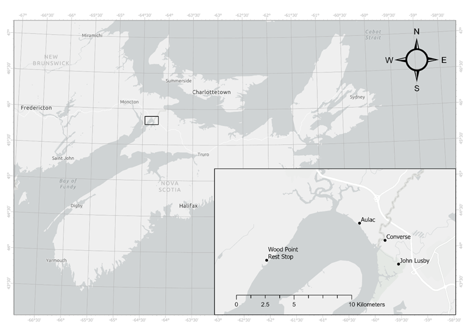 
Caption:  Four study sites in the Upper Bay of Fundy along the Cumberland Basin were chosen to represent salt marshes at different stages of restoration:  Converse - newly restored, Aulac - restored over 10 years ago, John Lusby - passively restored over 50 years ago, and Wood Point Rest Stop - natural reference site. Sites were chosen to be close to one another (<10 km apart) so environmental conditions like tides and weather were similar between sites.

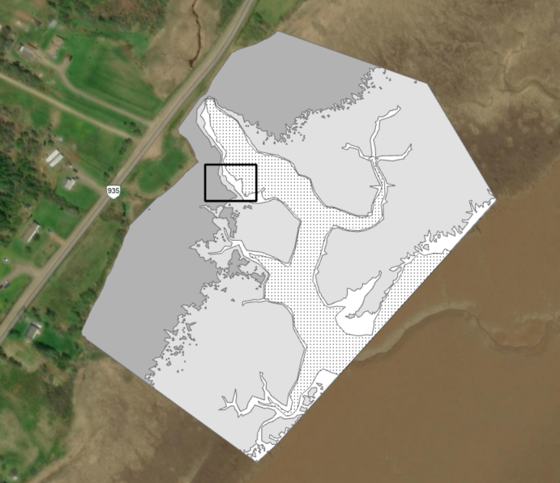 
Caption:  The Wood Point Rest Stop (WPRS) will be used as an example in this case study. Each site was divided into three elevation zones that are flooded by tides differently throughout the year:  the low zone is flooded by 75% of high tides in a year, the mid zone flooded by 50% of high tides, and the high zone is flooded by 25% of high tides. These zones are based on flooding frequency because decomposition of organic matter by microbes is slowed down in flooded, low-oxygen conditions.

#### Step 2:  Collection of sediment cores

 
Caption:  Three random points within each zone were chosen for core extraction using Geographic Information System (GIS) software (ArcGIS Pro) and the location of each point was surveyed using a high-accuracy GPS system. In total, nine cores were collected from each study site. The photo above shows someone surveying core locations at the Aulac site. The map below shows the location of nine cores in the Wood Point Rest Stop study site within the three elevation zones. 

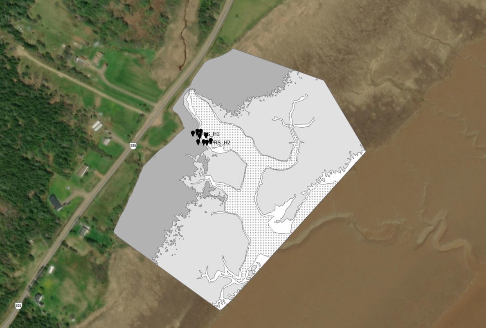 

 

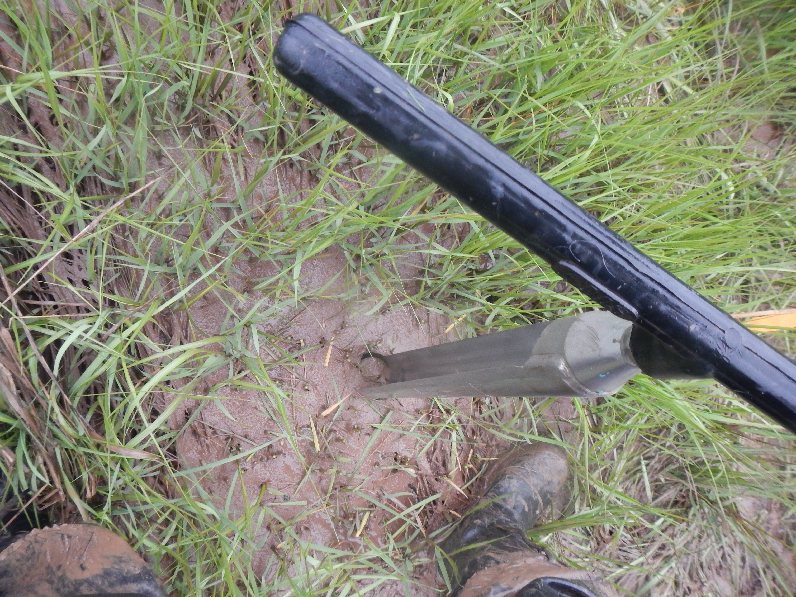 

 

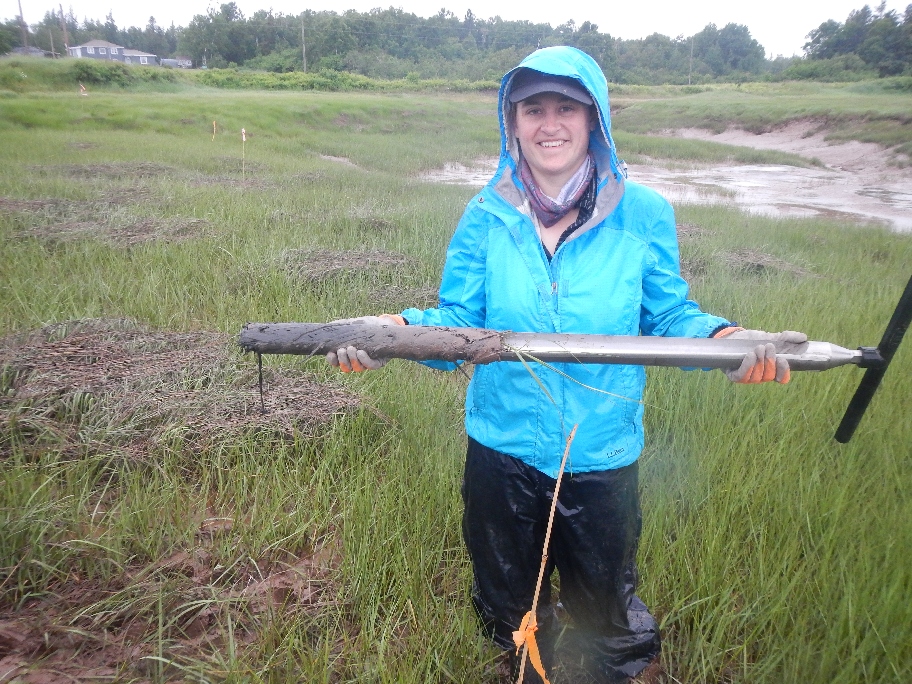 

Caption:  Cores were collected using a gouge auger, one of the many types of ‘corers’ available to use by soil carbon scientists. Other coring types include the ‘Russian peat corer’ (extracts half a core) and manual extraction (hammering a sharpened tube into the ground). Each of these methods will create different levels of core ‘compaction’, which can affect the overall length of the core and influence the estimate of how much soil organic carbon is contained within each core. Depending on the length of the core, the process of pushing the coring device into the ground and extracting a core can be physically demanding and often requires teamwork.

 

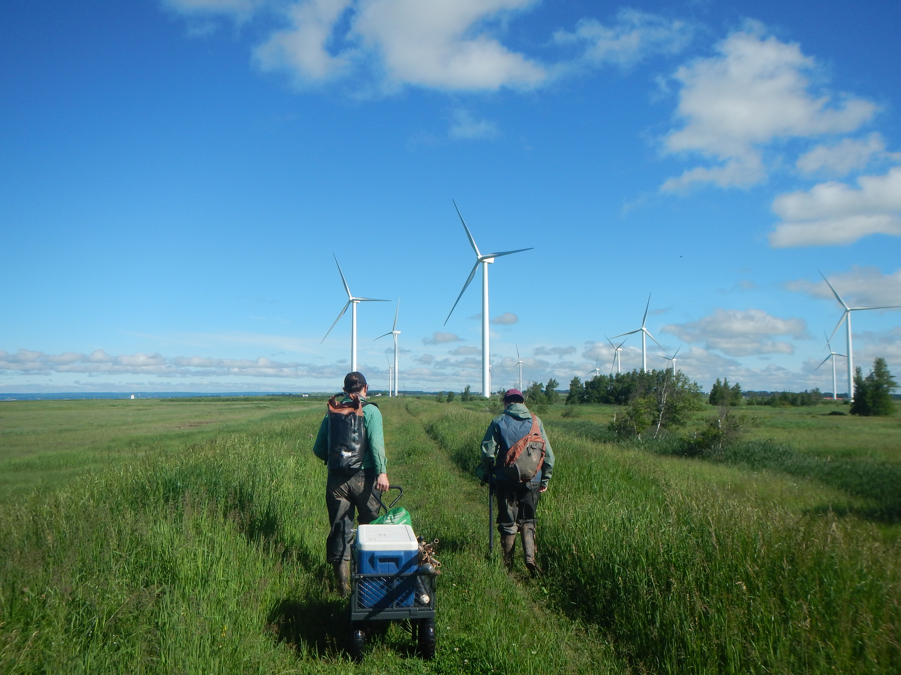 

Caption:  Transport and handling of cores after they are taken out of the ground is another important consideration for field work. Sometimes cores are cut apart and sampled in the field, and other times cores are packed in rigid plastic shells, wrapped in plastic-wrap, and refrigerated or frozen before being processed back in the lab. In salt marshes, researchers often have to walk far into study sites across uneven terrain with heavy equipment (like the corer and a cooler) to retrieve cores and bring them back.

#### Step 3:  Processing of cores in the lab

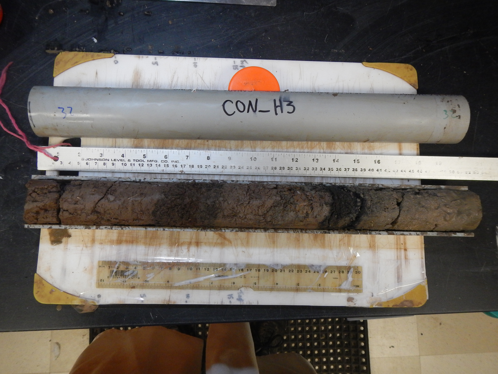 

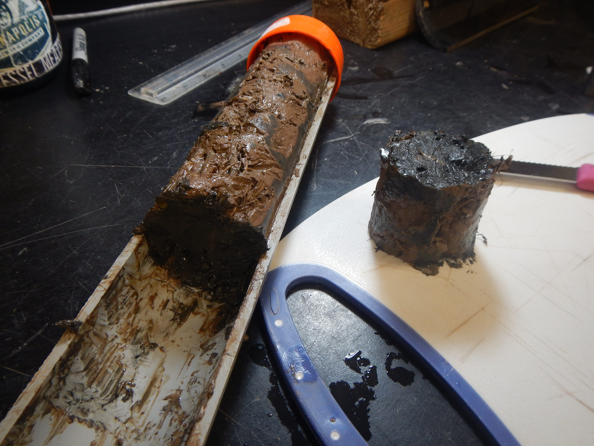 

Caption:  Once back in the lab, processing the core starts. The cores are photographed and different features like soil colour and texture are described and recorded. Then cores are divided into different increments depending on the goals of the study. For this study, 5 cm increments were chosen for a total of 10 per 50 cm core, which means that 360 individual samples were processed! When dividing cores, a compression factor should be used to adjust the increment length based on the compaction measured in the field. Compaction is often assumed equal across the entirety of the core. 

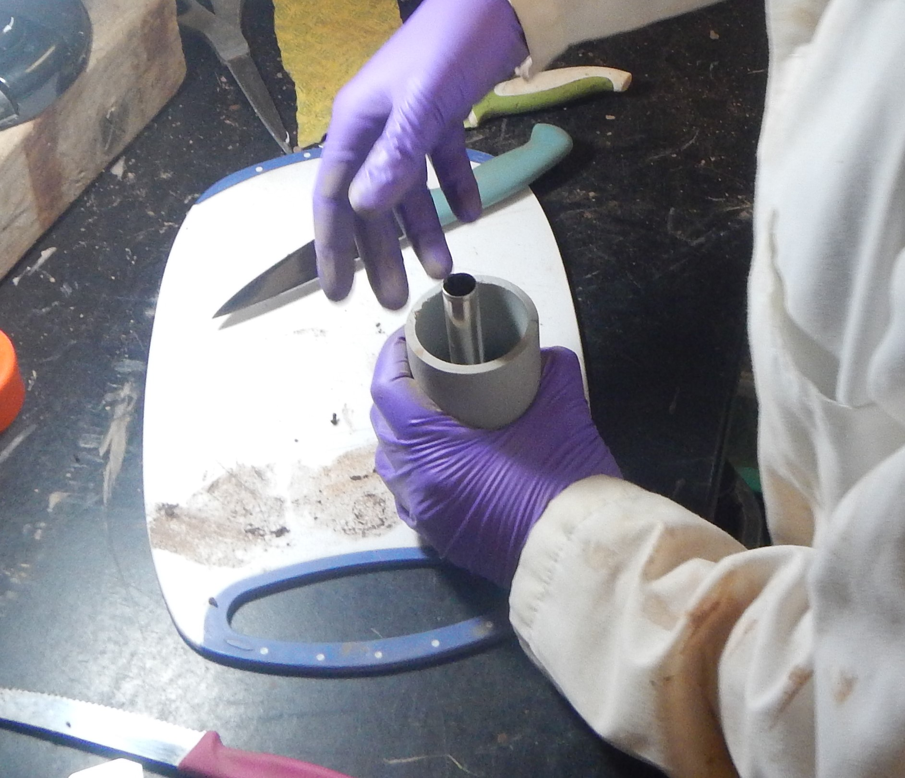 

 

 

 

Caption: To calculate how much organic carbon is in a core, two measurements are needed - ‘bulk density’ and ‘organic carbon content’ or ‘% organic carbon’. Core increments are usually sampled for bulk density first, which is a measure of the dry weight of soil within a known volume of the core. In the photo above, a metal cylinder was inserted into the centre of each 5 cm increment. The soil sample was extracted using a syringe plunger and then dried in an oven (see Step 4). Often the same soil sample is also used to determine the organic carbon content of the increment, but others can be cut from the core and stored until they are processed.

 

Caption:  Once processing is done, any remaining core segments are often archived and frozen for future analyses. Freezer and refrigerator space is a very important factor to consider when taking soil cores and designing the field study, as cores should be kept cold (< 4℃) to prevent decomposition of organic matter by microbes. 

#### Step 4:  Lab analyses for bulk density and loss-on-ignition (LOI)

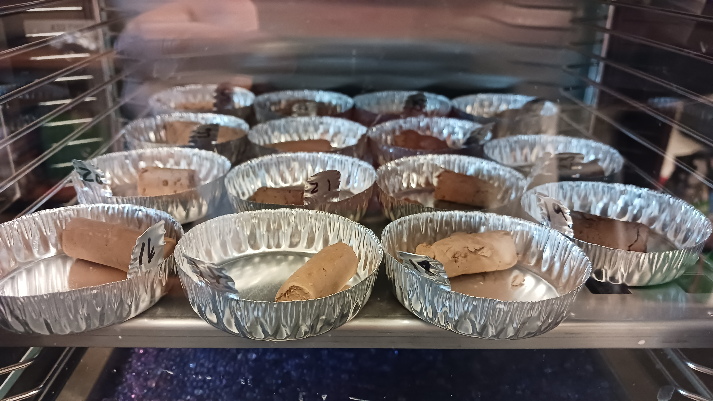 

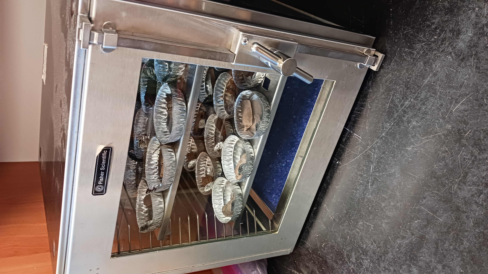 

Caption:  The soil samples of known volume taken from the core are first dried to determine the bulk density. Wet samples are placed in individually labeled tins, weighed, and then dried at 60 ℃ in a drying oven for 24-72 hours (or until a consistent dried weight is reached). After they are completely dry, they are re-weighed to determine dry weight of the soil sample. The photos above show the dried soil cylinders in a dessicator after the oven, which ensures the samples are fully dried before being re-weighed. Bulk density is written as the dry weight of soil divided by the known volume of the sample (g/cm3). Low bulk density means there is not a lot of soil within the volume of core sampled, which means the soil is less densely packed and there are more air pockets. Soils with low bulk density often have high organic matter content and water-holding capacity (like a sponge!). 

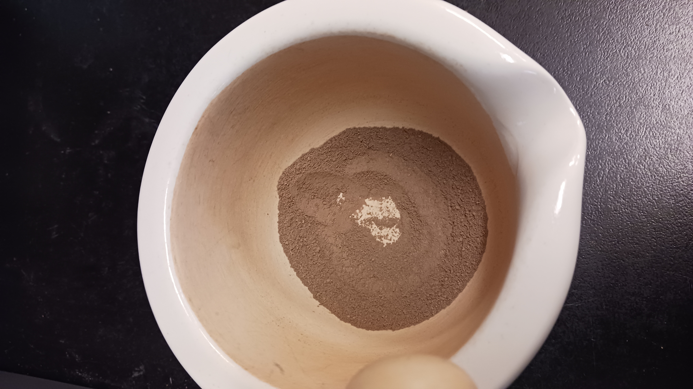 

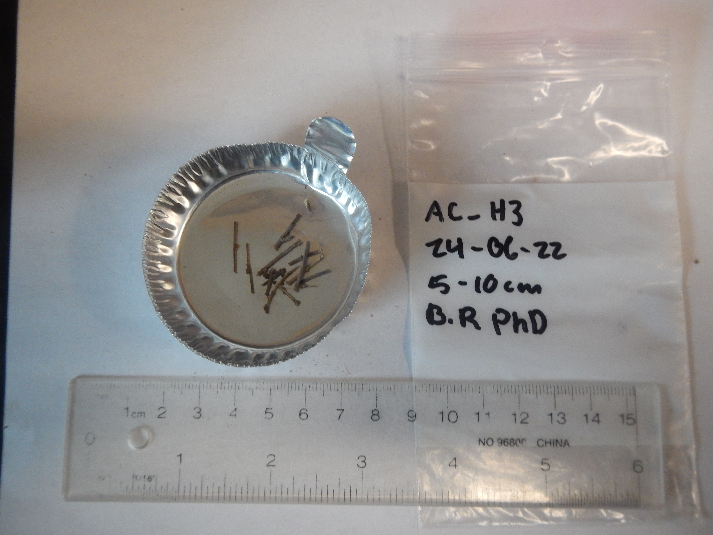 

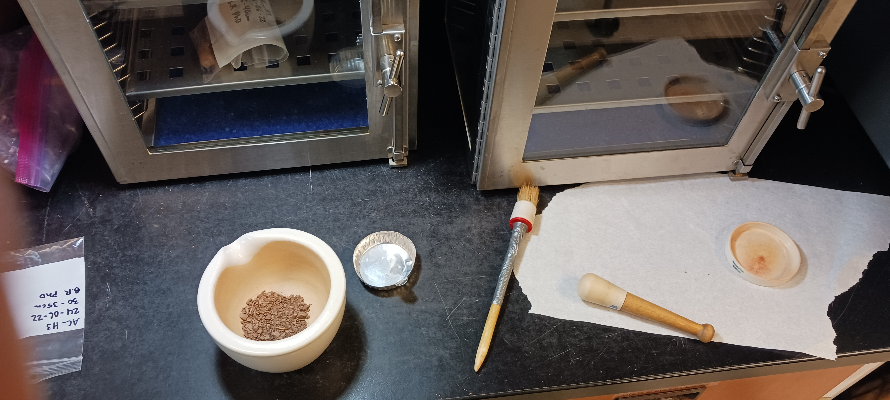 

Caption:  After the soil samples are dried and bulk density is determined, the soil samples are often processed for loss-on-ignition (LOI), which is an estimate of how much ‘organic matter’ is a soil sample. Before the samples are put into the furnace, small roots (> 2 mm) should be removed and the soil sample needs to be crushed into a homogenous sample, often using a mortar and pestle. Sometimes a sieve can be used to remove the small root particles, but often this step requires picking out small pieces of roots by hand using tweezers, which can be quite time consuming! Roots >2 mm are considered belowground biomass, which is different from the organic carbon that is stored in the soil.

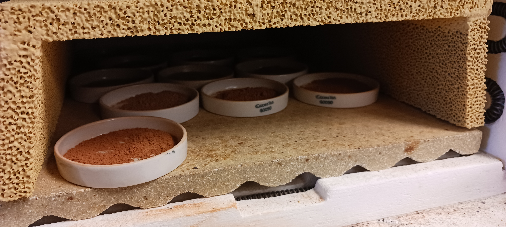 

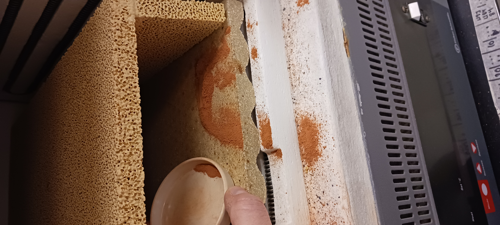 

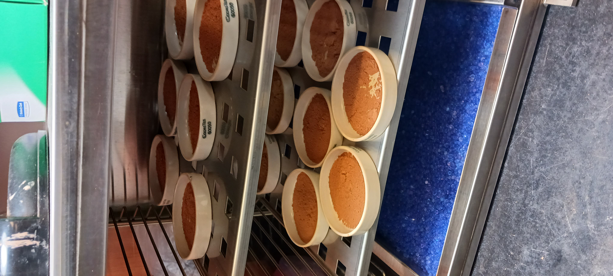 

Caption:  LOI involves combusting the soil sample at a high temperature (550 ℃) in a muffle furnace for 4 hours. Before the soil samples are put into the furnace, they are placed in a ceramic crucible and weighed to a consistent starting weight. After the samples are combusted, they are re-weighed to determine how much mass was lost, which corresponds to how much organic matter was burnt off from the sample and is represented by ‘% organic matter’ of the sample. Sometimes accidents happen but often duplicate or triplicate samples are done for LOI. For this study, half the samples had duplicates, for a total of 480 samples processed. As only 15 can fit in the muffle furnace at once, and the furnace often sits overnight to cool off after 4 hours, it can take a significant amount of time to get through that many samples (480 / 15 = 32 days!). Soil carbon scientists often use different methods for LOI, which may affect the comparison of results between datasets. As there is no standard method, it is recommended to report and be consistent in three parameters: ignition temperature, exposure time, and starting weight. 

#### Step 5:  Data processing and interpretation

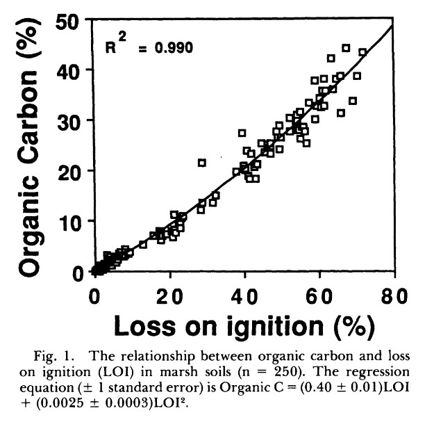 

Caption:  Once bulk density and % organic matter are determined, the ‘organic carbon density’ of each increment of the core can be estimated. Often % organic matter (%OM) is converted to % organic carbon (%OC) in salt marshes using a known conversion equation published in the scientific literature or roughly estimated by simply dividing %OM by 2. Some studies choose to determine the exact amount of organic carbon (%OC) in their samples by conducting ‘elemental analysis’ or sending the samples to another lab to do this analysis. More and more studies are now sending at least a subset of samples away to determine their own %OM-to-%OC conversion equations. Either way, this step involves more time to process samples or more money to pay for the analysis. In addition, soil samples should be treated to remove any inorganic carbon so elemental analysis results only reflect total organic carbon. The figure above is pulled directly from Craft et al. 1991 and shows the relationship between %OM and %OC for brackish and salt marsh sediments in North Carolina. For the data presented below in this case study, a local equation for %OM-to%OC was developed using data from sites located in the Upper Bay of Fundy. 

**Reference**
1.Craft, C. B., Seneca, E. D., & Broome, S. W. (1991). Loss on Ignition and Kjeldahl Digestion for Estimating Organic Carbon and Total Nitrogen in Estuarine Marsh Soils: Calibration with Dry Combustion. Estuaries, 14(2), 175. https://doi.org/10.2307/1351691

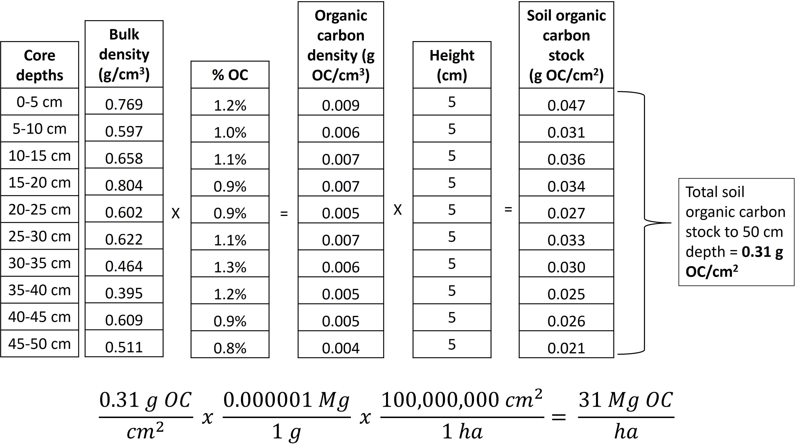 

Caption:  Once %OC of the increment is determined, this can be multiplied by the bulk density (g/cm3) to determine the organic carbon density of the core. Organic carbon density (g OC/cm3) is then multiplied by the height of each increment (5 cm in this example) to determine the amount of carbon within each core depth increment (g OC/cm2). Then all increments are added together to get the total ‘soil organic carbon stock’ throughout the core’s depth. This organic carbon stock (g OC/cm2 to 50 cm depth) can be scaled up to larger areas and compared to other studies. A common unit for carbon stock is megagrams (or tonnes) per hectare (Mg/ha). The figure above shows how to get from bulk density and %OC to total organic carbon stock and how to convert g/cm2 to Mg/ha using an example core from this case study. It’s important to note that if the Craft et al. 1991 equation was used to convert from %OM to %OC in this system, the organic carbon stock in this core would be overestimated by 100% or double (62 Mg/ha vs 31 Mg/ha OC).

### Case Study 2:  Soil carbon trade-offs associated with agricultural land use change in the Northwest Territories

#### Step 1: Choosing representative sites and study areas

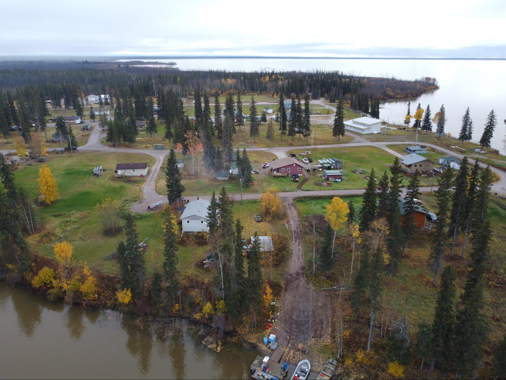 

Caption: We partnered with communities in the Northwest Territories, Canada such as Kakisa (shown here) to understand carbon and fertility trade-offs associated with agricultural cultivation of the boreal forest

 

Caption: In 2019, a soil sampling effort was conducted to assess the soil fertility and carbon content of sites that communities were interested in for agricultural development. Study sites were selected across a gradient of potential agriculture suitability ranging from class 3 (potentially the most suitable for agriculture) to class 7 (likely unsuitable for agriculture). Sites were also selected based on input from local community members

 

Caption: In 2021, a soil collection effort was undertaken to understand how soil fertility and carbon change between three different land use types; pre-cultivated forest soil, active agricultural soils, and abandoned agricultural soils. In partnership with seven farmers, 22 total sites were sampled. 

#### Step 2: Collection of soil cores

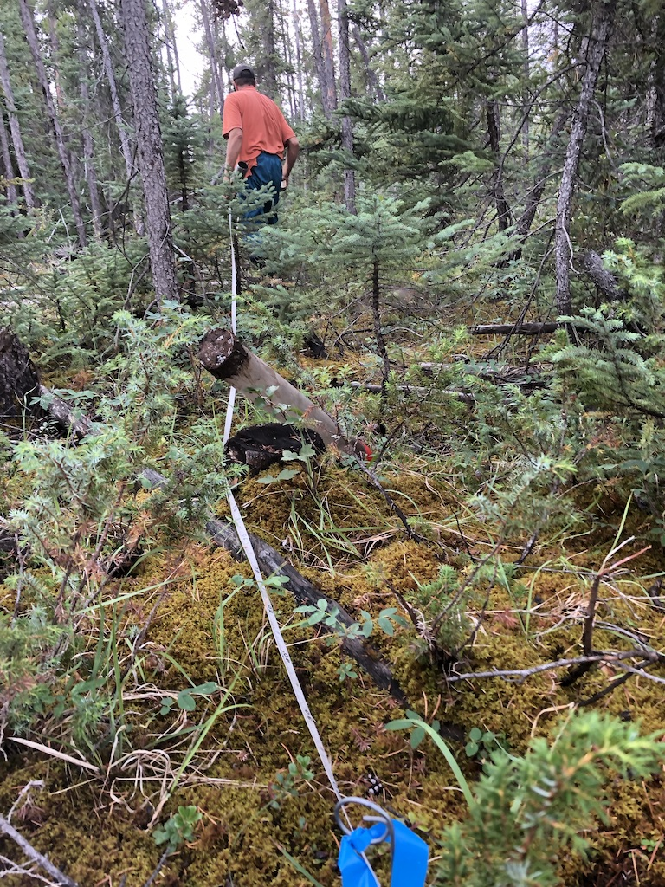 

Caption: 30m transects were established at each selected sample location

 

 

Caption: Cores were collected using a 30cm or 60cm stainless steel soil corer to capture the entire organic layer of the site. For each transect, six soil cores were collected. Once extracted from the ground, cores were placed and sealed in plastic tubes.

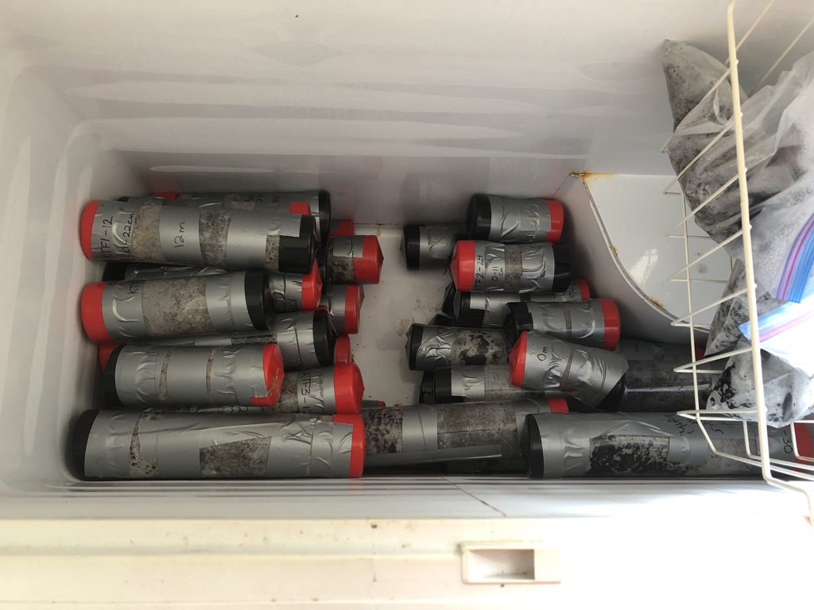 

Caption: Soil cores were stored in a freezer to limit decomposition processes. Upon departure from the Northwest territories, samples were shipped back to the University of Guelph and stored at 4 degrees celsius. 

#### Step 3: Processing of cores in the lab

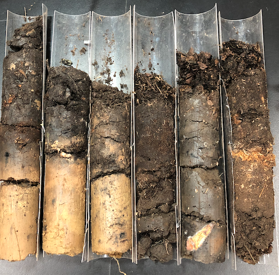 

Caption: The entirety of the organic layer of the soil cores was analyzed to determine soil macronutrient fertility (consisting of nitrogen, phosphorus, and potassium) as well as soil organic carbon stocks.

 

Caption: Soil cores were subdivided into 5cm increments to assess how variables change with depth throughout the core

 

Caption: In total over 1500lbs of soil was analyzed and processed  from 2019-2022 in support of this project. 

#### Step 4: Data interpretation

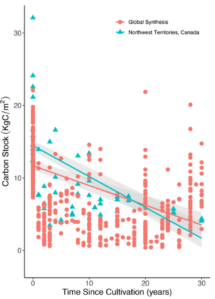 

Caption: Based on the soil data we collected and the results of a global synthesis of studies, we found that soil organic carbon stocks significantly decline with increasing time since cultivation. This is concerning as the boreal forest represents the largest pool of terrestrial carbon.

 

Caption: We also found differing relationships between soil organic carbon and soil fertility in our study sites. In agricultural soils (both active and abandoned) soil fertility and soil carbon are positively correlated. In pre-cultivation or undisturbed sites, soil fertility and soil carbon are negatively correlated. This negative correlation is important from a land management perspective as we can target areas of high fertility, but low soil carbon to limit potential carbon losses.

 

Caption: We were able to use the soil data to create a map that highlights areas of lower amounts of soil organic carbon (shown in white) and high macronutrient fertility (larger circles). This serves as a preliminary land management tool that can help communities make decisions that limit carbon losses upon cultivation

### Best Practices and Opportunities
Collecting field data for scaling requires (1) funding & resources, (2) background research to plan the most effective sampling scheme to capture as much variability as possible, (3) a network of researchers, stakeholders, and community members using standard methodologies to allow for the comparison of data across time and space, and (4) collaboration with people using the data (e.g. modelers) to help identify the type of data that will be needed before it is collected. 

Spending the time planning your field work is essential. Integration of modelers in this planning is even more important if the data is intended to be used in future studies of scaling. Planning ensures unexpected events and missing data can be dealt with and will not influence the overall dataset. 

*Photos by Britney Roughan & David Bysouth*

<!--- Britney given instruction on what shp to use here: https://docs.google.com/document/d/1UHZfDVqn3GXgsXRaUJjF5mzvDAjjFpLBJBNfwnIFeyA/edit --->

