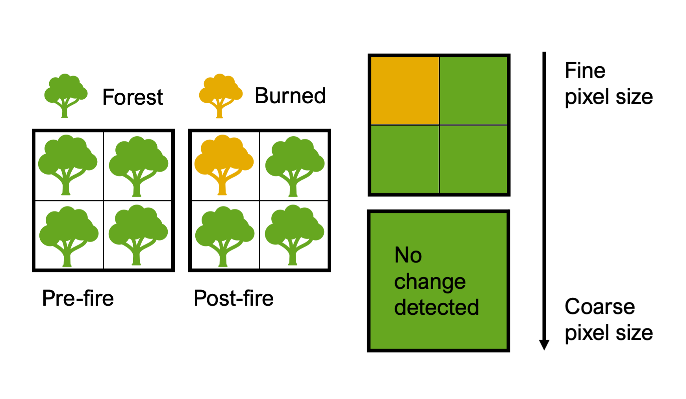
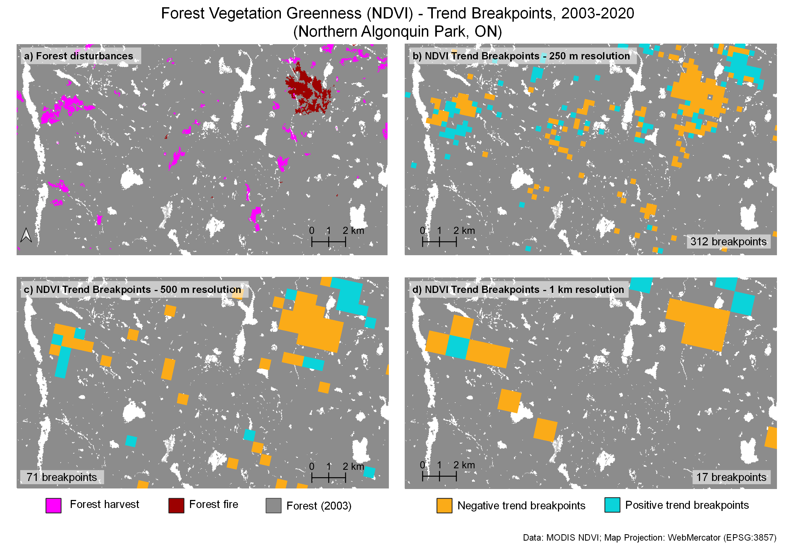

# Why does spatial resolution matter? 

We often need detailed data to detect change. In this example, we discuss why we need data at finer pixel sizes to detect forest losses and gains.

## Introduction

When we change the spatial resolution of a pixel, we change the number and type of elements (for example land cover types) that compose it. This can impact the results of our studies, especially those where we attempt to classify pixels based on their composition.

 

*Created by Amanda Schwantes and Peter Rodriguez*

### Case study

In the figure on the top right, we show two major forest disturbance agents (panel a) and the results of a geo-spatial trend analysis (panel b to d) over a relatively small study area (26,000 ha) located along the northern boundary of Algonquin Provincial Park (Ontario). The greenness of forests, as measured by the Normalized Difference Vegetation Index (NDVI), shows trend breakpoints over an 18-year long period (2003-2020). Trend breakpoints refer to structural (abrupt) changes in the trend line of a measurement. Trend breakpoints can be positive or negative and can result from natural or anthropogenic disturbances.

When using satellite derived (MODIS sensor) NDVI at a 250 m resolution (panel b) we find 312 different trend breakpoints in the data. Most of these are negative breakpoints (orange color pixels), meaning that some forest areas have experienced important abrupt decreases in greenness at some point in time. However, there are also some forest areas that have seen significant abrupt increases (turquoise color pixels) in greenness at a point in time. When a 500 m resolution NDVI is used instead (panel c), the number of breakpoints drops to 71. Similarly, when a 1 km resolution NDVI is used (panel d), the number of breakpoints further decreases to 17.

Interestingly, not only does the number (and direction/sign) of forest pixels with trend breakpoints change depending on the resolution of the data but also the location of these pixels over the study area. Some of these trend breakpoint pixels spatially and temporally overlap with forest harvest and fire events. The largest overlaps occur when using the finest spatial resolution (250 m) data. Thus, the spatial resolution of a dataset may influence the results obtained and in turn, the management decisions that may arise from them.

 

*Created by Peter Rodriguez*

<!--- Use shapefiles in resnet_upscaling_story_map folder over esri earth imagery for challenge background --->

### Best practices and opportunities

In cases where different data resolutions are available, the recommendation is to use data at the finest spatial resolution to ensure that potentially relevant ecological patterns are not missed.
Even though fine scale data usually leads to improved accuracy (Fig. a & b), there are several constraints to keep in mind such as data availability, data storage, computing power, time, and financial resources (Fig. c). Finer grain size (i.e., smaller pixel size) usually leads to improved accuracy but some processes actually plateau at a certain resolution and there is no need to go finer (b). This threshold is often used as a baseline for future studies. Higher resolution often comes with increases in cost and time and hence, it is important to identify the most optimal resolution (grain size) for a given study based on resources available.

 

*Created by Peter Rodriguez & Amanda Schwantes*
