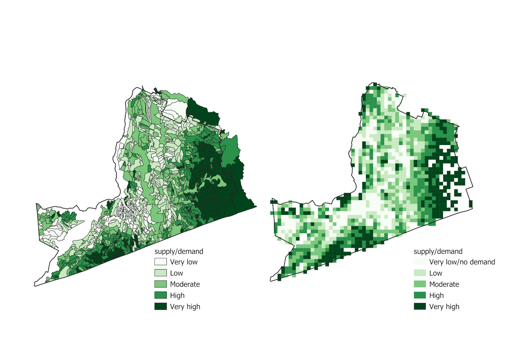

# How to choose the scale for summarizing data?

## Description

We often report data by summarizing individual information (e.g., at a pixel) to coarser scale analysis units (e.g., census division). In this example, we discuss the consequences of summarizing data to different units.

## Introduction

In addition to the resolution, boundaries used to aggregate smaller scale data may influence the visual assessment of ecosystem service supply and demand information and relationships.

### Case study

Pollination supply and demand aggregated to watersheds (left) tend to show ecosystem service surplus (i.e. higher ratios) at areas with little demand, while the supply and demand relationships represented at 3km grid cells (right) can help identify more precisely high demand areas that could benefit from more agricultural support.

 

Caption: Image supply-demand ratio. Left: Ratio of pollination supply potential to the area of dependent crops summarized to the watersheds. Right: Ratio of pollination supply potential to the area of dependent crops summarized to a 3km grid

### Best practices and opportunities

1) Carefully consider the aggregation, reporting, or zonal unit by assessing variance or representativeness (i.e., percentage of outcome agreement and disagreement between scales).
2) Consider the effects of aggregating information at the ecologically meaningful level into a socially meaningful or management level.

<!--- Use shapefiles in /data/challenge_2b --->

*Created by Yiyi*
