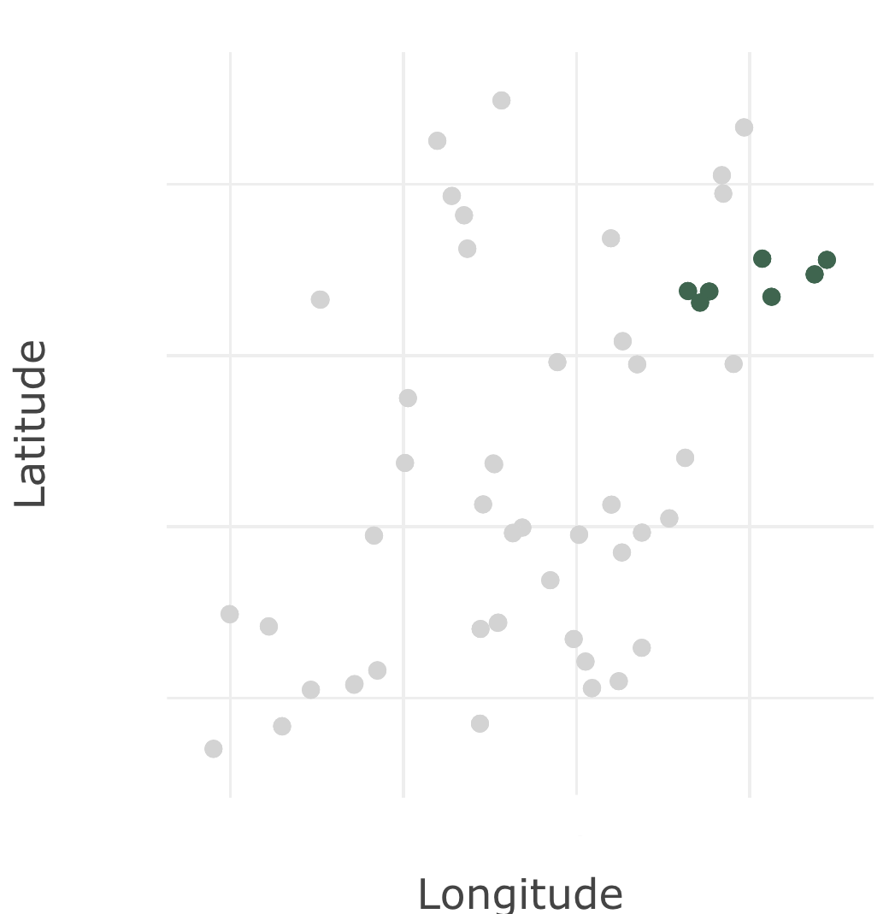
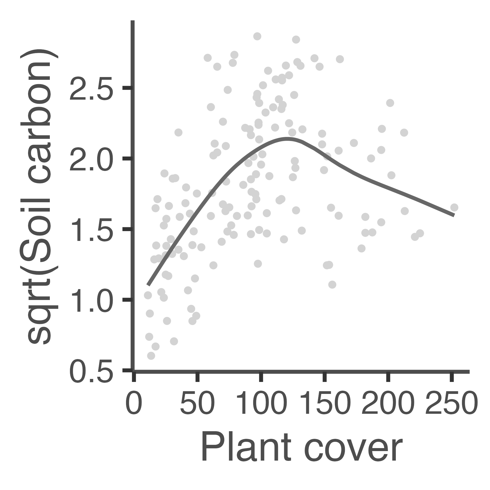

# How to consider non-linearities?

## Description

Relationships may differ over time or space. This example discusses the consequences of generalizing our results outside of the original study area. 

## Introduction

Often we assume a relationship between two variables is linear; however, if we increase the spatial extent we may see a nonlinear relationship appear. This is important, because we often predict in areas outside of where we sample. If we assume a relationship is linear, when it is not, then our extrapolations will be incorrect.

### Case study

In this case study, we show the relationship between soil carbon and plant cover in vacant lots in Quebec city. Plant cover can be greater than one in densely vegetated vacant lots when leaves overlap. In this study, vacant lots were carefully selected to represent the entire range of plant cover. However, a less careful scientist could have selected only a subset of these vacant lots (green dots on map). The relationship between soil carbon and plant cover only within this subset (green dots on map) is linear (green line) and would lead to an incorrect extrapolation to the whole study region. When using data from the whole study region (e.g., increasing the spatial extent), we find that the relationship is actually non-linear (gray line). In vacant lots with high plant cover, other factors (e.g., soil type, land use history, etc.) might be needed to better explain the variability of carbon.

 

 

 

Data source: Mendes P; Bourgeois B; Pellerin S; Ziter CD; Cimon-Morin J; Poulin M. Linkages between plant functional diversity and soil-based ecosystem services in urban and peri-urban vacant lots. Urban Ecosystems. 10.1007/s11252-023-01470-5

### Best practices and opportunities

1) If funding and time allows, sample across a larger spatial extent to capture the full range of each variable.

2) When extrapolating outside of the original study region consider whether the new study region’s environmental variables are within the same range as the original study. If not, consider whether a non-linear relationship is likely.

3) Seasonality can also result in nonlinear relationships between a variable and time (e.g., temperature). To account for variables that vary across a year, we may need to monitor at the same time each year or more frequently within the year. Phenological changes are shifting with continuing climate change, which makes monitoring more frequently over time especially important.

<!--- Use shapefiles in /challenge_2c/data --->

*Created by Poliana Mendes*
