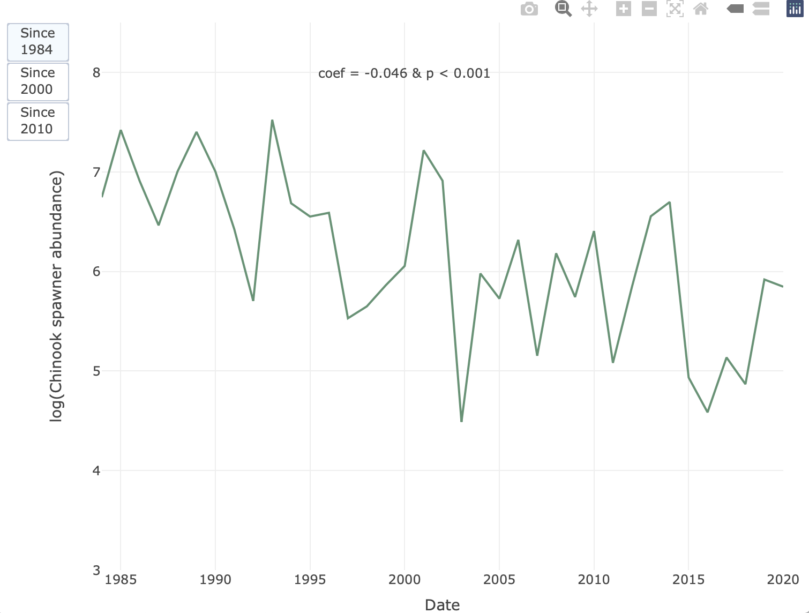

# How does the monitoring time period influence outcomes?

## Description

To understand whether an ecosystem is changing, we measure it over time. However, if we only measure the ecosystem over a short time, then we may not detect a change, even when the ecosystem has changed. This example explores how the monitoring time-period influences outcomes.

<!--- Leaflet map with shapefile of study region. Content/archive_agm2023/Challenges/Challenge 2d/Archive.zip -->

## Introduction

Often we use time series analysis to understand whether an ecosystem property or service is changing over time. The temporal extent (e.g., time frame or period) of the monitoring data can affect outcomes. For shorter time-series or time-series with high variability, we may not have a correct historical baseline to detect change. For example, if monitoring data does not extend far enough into the past, then an insignificant trend could be interpreted as evidence for stability or no effect, when in reality the system might already be in a degraded state.

### Case study

In this example, we show how Chinook salmon populations are changing in the Salmon river, British Columbia, Canada. In this region, Chinook salmon are important for the way of life for Indigenous communities, the economy, and the environment. Here, we show differences in trend significance depending on the start of a monitoring program. For example, if salmon monitoring only started 10 or 20 years ago (click on “since 2010” or “since 2000” buttons), then no significant downward trend would have been detected. However, if we begin our time-series analysis in 1984, then we see a significant downward trend: slope = -0.046 and p-value < 0.001.

Data Source: Fisheries and Oceans Canada. 2021. NuSEDS-New Salmon Escapement Database System. Retrieved [here](https://open.canada.ca/data/en/dataset/c48669a3-045b-400d-b730-48aafe8c5ee6) on Jan 13, 2022.

 

### Best practices and opportunities

Even when monitoring data are available for 30+ years, we know ecosystems have been changing over centuries. For example, current observations of salmon in the Salmon River are very different from historical reports.

“In the grey of early morning I … found the river full of sockeye running upstream. I put in an oar and felt that the river was half fish. The increasing light soon showed that it was red from bank to bank. Then a stampede or panic occurred, and the salmon came surging down, but the river was so full of ascending fish that they blockaded and made a great flat wriggling dam. So jammed were they that they crowded out, and were rushed up the sloping banks out of the water.” -David Salmond Mitchell, fisheries officer 1905

Source for quote: Burt DW and Wallis M. 1997. Assessment of salmonid habitat in the salmon river, salmon arm. Department of Fisheries and Oceans. Vancouver, B.C.

When appropriate historical baselines are unavailable, comparisons can be made with an equivalent reference site. However, in the age of the anthropocene, finding an appropriate reference site can also be challenging. Therefore, when reading papers and reports, we suggest critically evaluating how baselines and reference sites were selected and how these choices could impact outcomes.

<!--- Use shapefiles in /data/challenge_2d , also see plotly_baselines.R or http://dev.xylemgeo.com --->

*Created by Amanda Schwantes*
